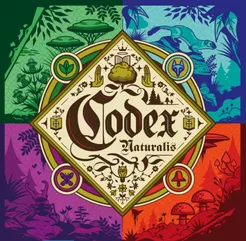
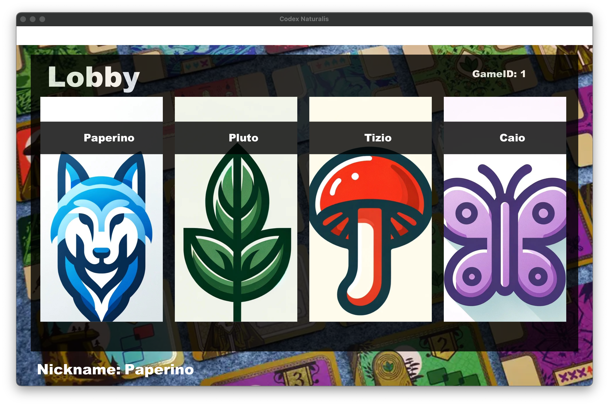
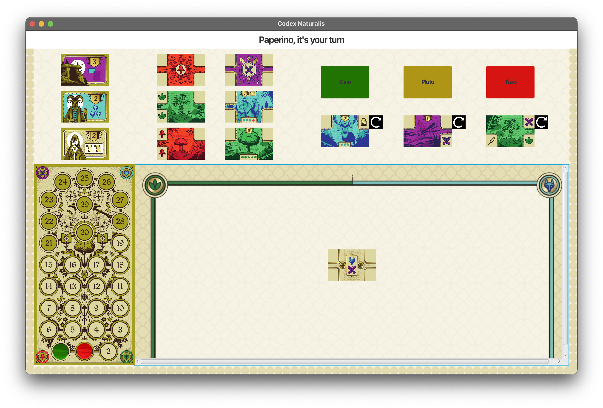
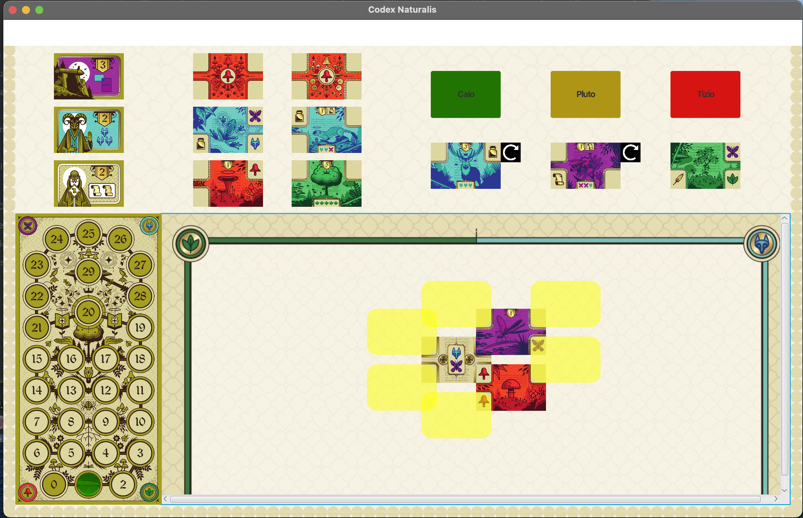
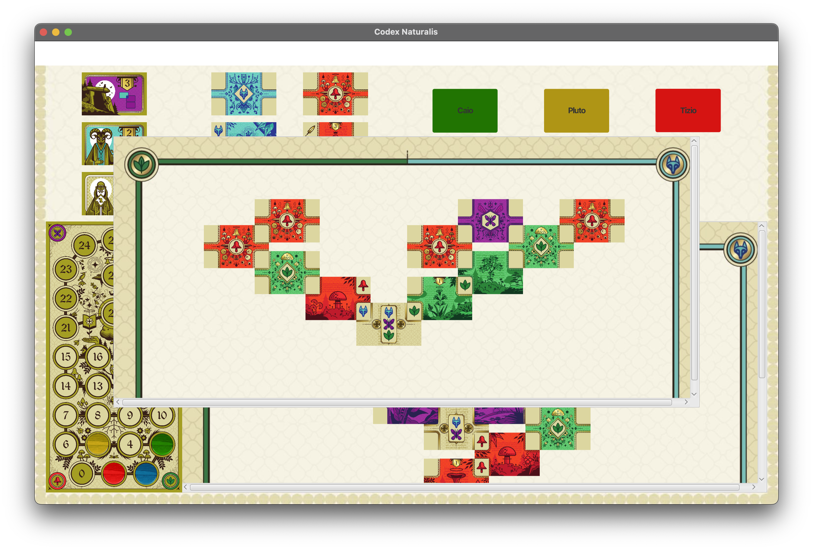
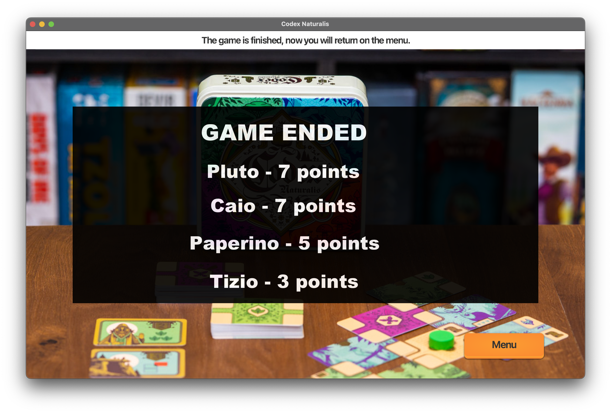

# Codex Naturalis

> 

**Codex Naturalis** is the final test of **"Software Engineering"**, course of **"Computer Science and Engineering"** held at Polytechnic University of Milan (2023/2024).

**Teacher:** San Pietro Pierluigi

The final vote is: **30/30**.


## The Team
* [Luca Gritti](https://github.com/lucanotluka) (10765611)
* [Fabio Marco Floris](https://github.com/FabioFloris02) (10811227)
* [Marco Ferraresi](https://github.com/marcoferraresi02) (10764701)
* [Angelo De Nadai](https://github.com/Angelo-De-Nadai) (10834883)

## Project specification
The project is a Java game, Cranio Creation's CODEX NATURALIS.

The final version includes:
* Model UML diagram;
* Working game implementation, which has to be rules compliant;
* Source code of the implementation;
* Source code of unity tests.
* [PowerPoint Presentation](https://polimi365-my.sharepoint.com/:p:/g/personal/10765611_polimi_it/EfaFHHvY8QNGnwScx4WYfgIBGES8eK_8u1CH3zuuDCMbWA?e=VoKwIP) of our project.

## Implemented Functionalities
| Functionality |                                                                                                                                          Status                                                                                                                                           |
|:-----------------------|:-----------------------------------------------------------------------------------------------------------------------------------------------------------------------------------------------------------------------------------------------------------------------------------------:|
| Basic rules |                                                                                 ✅                                                                                  |
| Complete rules |                                                                                  ✅                                                                                 |
| Socket |                                                                                  ✅                                                                                |
| RMI |                                                                                 ✅️                                                                              |
| TUI |                                                                             ✅️                                                                             |
| GUI |                                                                                                                                          ✅️                                                                                                                                           |
| Multiple games |                                                                                                                                          ✅️                                                                                                                                           |
| Resilience |                                                                ✅                                                             |
| Persistence |                                                                                                                                           ⛔                                                                                                                                           |
| Chat |                                                                                                                                           ⛔                                                                                                                                           |

#### Legend
[⛔]() Not Implemented &nbsp;&nbsp;&nbsp;&nbsp;[⚠️]() Implementing&nbsp;&nbsp;&nbsp;&nbsp;[✅]() Implemented


<!--
[](#)
[](#)
[](#)
-->

## Test cases
The tests made for the Model package - 22 classes - has a total Line coverage of 97% (487/500).

**Coverage criteria: code lines.**

| Package | Tested Class        | Coverage |
|:-----------------------|:--------------------|:------------------------------------:|
| Model | Global Package      | 487/500 (97%)
| Model | Cards         | 146/149 (97%)
| Model | Objectives | 52/56 (92%)
| Model | Others          | 289/295 (98%)


## Compile and Run
To run the tests and compile the software:

1. Install [Java SE 22](https://www.oracle.com/java/technologies/javase/jdk22-archive-downloads.html);
2. Clone this repo;
3. Open a Command Prompt/Bash terminal. We don't recommend using Windows PowerShell.
4. Move in deliverables/final/jar directory, where you will find the JAR files, which already includes the project dependencies.
5. Execute these commands:
```bash
// (For Windows users only: this command changes the character encoding, for a better User Experience)
CHCP 65001

//Start the Server
java -jar softweng-1.0-server.jar

//Start how many Clients you want!!
java -jar softweng-1.0-client.jar
```
6. You can play with two or more Clients, knowing the actual Server's IP address.

# Game Screenshot









## Software used

**StarUML** - Initial UML and sequence diagrams

**Intellij IDEA Ultimate** - main IDE

## Copyright

Codex Naturalis Board Game is copyrighted.
